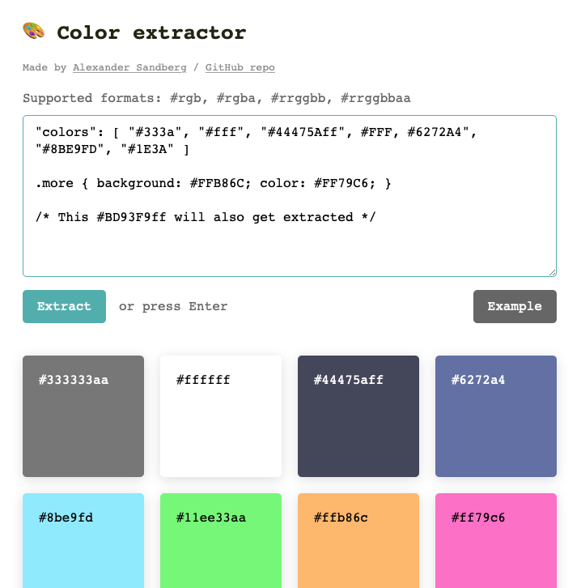

# Color extractor

## About the project
This is a simple tool that allows you to extract unique color values from a piece of code.

Currently, the tool supports the following (*case insensitive*) formats: `#rgb`, `#rgba`, `#rrggbb`, and `#rrggbbaa`.

## Usage
[**Check it out live**](https://alexandersandberg.github.io/color-extractor/) *or* download the files and open `index.html` in your preferred browser.

## Preview

## Contributing
Feel free to open issues for feature requests or bugs!

## About
*A project by Alexander Sandberg*

You can find me online here: 
* [Website](https://alexandersandberg.com) 
* [Twitter](https://twitter.com/alexandberg) 
* [Medium](https://medium.com/@alexandersandberg) 
* [Instagram](https://www.instagram.com/sandbergalexander/) 
* [LinkedIn](https://www.linkedin.com/in/sandbergalex/) 

## License
Distributed under the MIT License © [Alexander Sandberg](https://github.com/alexandersandberg)
